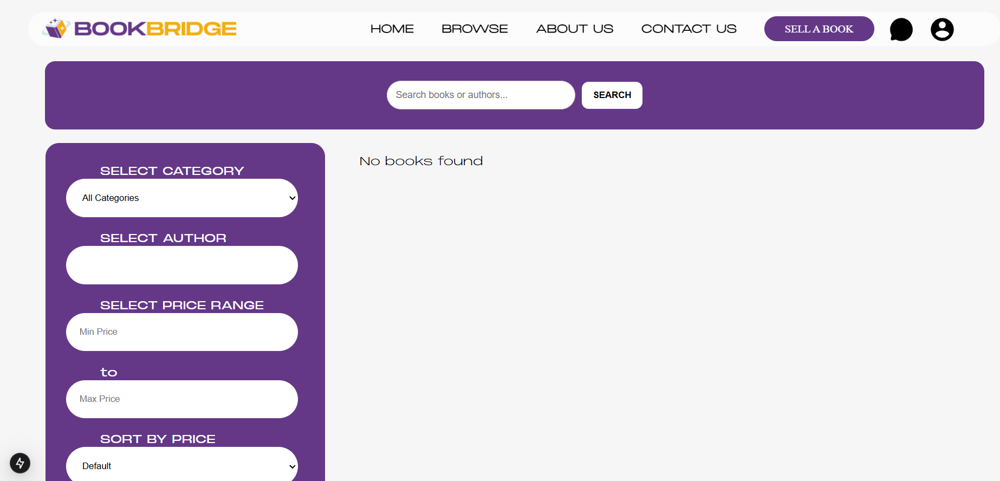
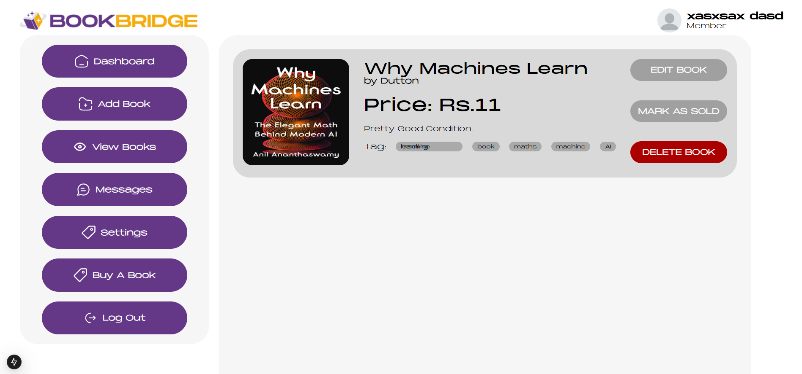
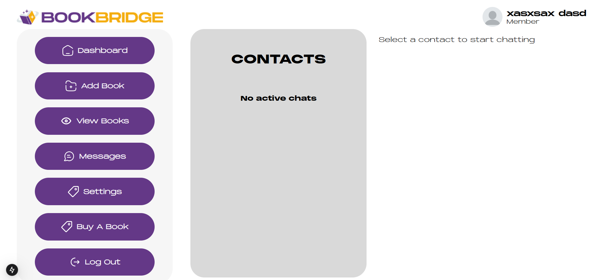
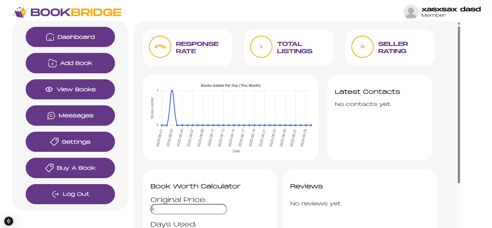

# 📚 BookBridge Dashboard

> **A secure, community-driven used book marketplace**  


---

## 🚀 Overview

**BookBridge** is a full-stack web platform that empowers individuals to buy and sell used books through a secure, verified, and user-friendly marketplace. It addresses core limitations found in existing systems, such as lack of trust, poor search functionalities, and unsafe communication channels by offering a comprehensive book trading dashboard equipped with real-time chat, seller analytics, verified listings, and feedback mechanisms.

---

## 🌟 Key Features

- 🔐 **Secure User Authentication** — Firebase-powered login with encrypted storage
- 🛍️ **Book Listing + Verification Workflow** — Admin-reviewed listings ensure trust
- 🔎 **Advanced Search & Filtering** — Find books via ISBN, genre, author, condition, and price
- 💬 **Real-time Buyer–Seller Chat** — Negotiate instantly, powered by Firestore
- 📊 **Seller Analytics** — Track views, trends, and manage pricing effectively
- ⭐ **Ratings & Feedback System** — Community-based trust model
- 🧑‍⚖️ **Moderation Dashboards** — Tools for admins to manage content and users
- ⚡ **Fully Responsive** — Desktop & mobile-friendly frontend built with React & Tailwind CSS

---

## 📸 Preview Screenshots

| Page               | Preview |
|--------------------|---------|
| Home               |  |
| Browse Books       |  |
| Book Detail        |  |
| Chat Interface     |  |
| Seller Dashboard   |  |

---

## 🎥 Video Walkthrough

Check out a complete walkthrough of our homepage:

> **Note**: Due to GitHub's file size limitations, the video needs to be downloaded to view.

> 1. Navigate to [`assets/bookbridge-home.mp4`](./assets/bookbridge-dashboard-guide.mp4)
> 2. Click "Download" to view the full homepage demonstration
> 3. Duration: 1:34 minutes

<details>
<summary>📽️ What's in the video?</summary>

- Complete webpage navigation
- Search functionality demonstration
- Real-time book walkthrough
- User interface interactions
- Responsive design showcase
</details>

---

## 🛠️ Tech Stack

| Layer       | Technology              |
|-------------|--------------------------|
| Frontend    | React.js (TypeScript), Next.js |
| Styling     | Tailwind CSS            |
| Backend     | Firebase (Firestore, Auth, Storage) |
| Hosting     | Firebase Hosting / AWS EC2 |
| Chat System | Firebase Firestore      |
| Media       | Cloudinary              |

---

## 🧪 Testing & QA Highlights

BookBridge was tested extensively using a range of methodologies:

- ✅ Unit & Integration Testing (Jest, Mocha)
- 🔐 Security Testing (Auth rules, HTTPS encryption)
- ⚙️ Performance Testing (1000+ concurrent users, <2s response time)
- 🧪 Usability Testing (task-based feedback from users)
- 🎯 Acceptance Testing (against functional & non-functional requirements)

---

## 🏁 How to Run the Project Locally

```bash
# 1. Clone the repository
git clone [https://github.com/deaneeth/bookbridge-dashboard]
cd bookbridge-dashboard

# 2. Install dependencies
npm install

# 3. Add your Firebase config to `.env.local`
NEXT_PUBLIC_FIREBASE_API_KEY=...
NEXT_PUBLIC_FIREBASE_AUTH_DOMAIN=...
# (other required variables)

# 4. Start the dev server
npm run dev
```

### 💡 The app uses Next.js for SSR and Firebase for real-time DB & auth.

---

## 📌 Project Milestones

✅ Functional MVP with secure login, real-time chat, search

✅ Admin & seller dashboards with moderation tools

✅ User feedback, analytics & role-based access

⚠️ Planned: Mobile apps (iOS/Android), integrated payments, AI-based moderation

---

## 🔒 Security & Best Practices Followed

✅ Firebase Authentication with role-based access

✅ Data encryption (HTTPS, Firestore rules)

✅ Manual + automated security audits

✅ Protected routes and modular component access

✅ SEO and responsive design adherence

✅ Agile sprint-based version control and CI principles

---

## 📄 License
This project is licensed under the MIT License. See  for more details.

## 🤝 Contributing
We welcome contributions! Please fork the repo, open a pull request, and follow our contribution guidelines in 

## 📬 Contact
Have questions or suggestions?
Feel free to reach out via issues or contact the maintainers via GitHub.

> Made with ❤️ for the book reading community